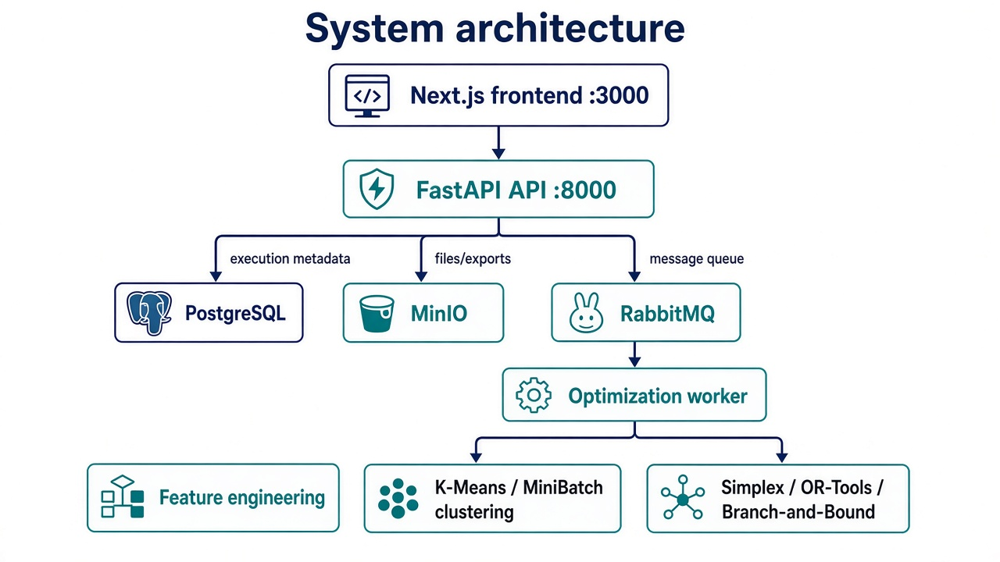
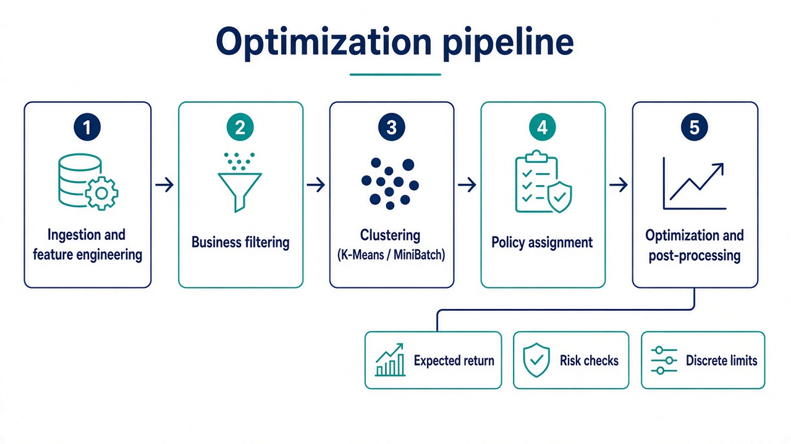

<p align="center">
  <strong><a href="https://www.inteli.edu.br/">Inteli — Instituto de Tecnologia e Liderança</a></strong>
  · Academic partner:
  <strong><a href="https://www.bancopan.com.br/">Banco PAN</a></strong>
</p>

# Credit Portfolio Optimizer

Full-stack decision-support system for assigning pre-approved credit limits across a portfolio. Combines customer segmentation, linear/integer optimization, asynchronous job processing, persistent execution history, and an analytics UI.

> **Academic origin (Inteli · Module 6 · Group G03)**  
> Developed during **Module 6 (CCMD6 — Combinatorial Optimization & Operations Research)** of the B.Sc. in Computer Science at [Inteli](https://www.inteli.edu.br/), as a partner project with [Banco PAN](https://www.bancopan.com.br/) / BTG Pactual.  
> This GitHub repository is a **sanitized public portfolio edition**: no original partner dataset, internal reports, branding assets, or proprietary analyses are included. The sample CSV is synthetic.

## Credits

### Team — Group 03 (G03)

- [Bernardo Laurindo Gonzaga](https://www.linkedin.com/in/bernardolaurindo/)
- [Eduardo Jesus Tavares Sant'Anna](https://www.linkedin.com/in/eduardo-jesus-/)
- [Gabriel Willian Bartmanovicz](https://www.linkedin.com/in/gabriel-bartmanovicz/)
- [Kethlen Martins da Silva](https://www.linkedin.com/in/kethlenmartins/)
- [Lívia Sabóia Tavares](https://www.linkedin.com/in/livia-saboia-tavares/)
- [Lucas Michel Pereira](https://www.linkedin.com/in/lucas-michel-pereira-1a338734b/)
- [Thúlio Sallum Bacco Pinto](https://www.linkedin.com/in/thulio-bacco-55a1172b4/)

### Faculty

**Advisor**

- [Tomaz Mikio Sasaki](https://www.linkedin.com/in/tmsasaki/)

**Instructors**

- [Bruna Mayer Costa](https://www.linkedin.com/in/bruna-mayer/)
- [Fillipe Manoel Xavier Resina](https://www.linkedin.com/in/fillipe-resina-b2211a22/)
- [Laíza Ribeiro Silva](https://www.linkedin.com/in/laizaribeiro/)
- [Maria Cristina Nogueira Gramani](https://www.linkedin.com/in/cristinagramani/)
- [Natalia Varela da Rocha Kloeckner](https://www.linkedin.com/in/natalia-k-37a62052/)
- [Rodolfo Riyoei Goya](https://www.linkedin.com/in/rodolfo-goya-6ab187/)

## Technical highlights

- Portfolio optimization with custom Simplex, OR-Tools Simplex, and Branch-and-Bound.
- K-Means and MiniBatch K-Means segmentation with configurable policy assignment.
- FastAPI backend with PostgreSQL persistence and typed request/response contracts.
- RabbitMQ worker for asynchronous optimization runs and progress tracking.
- MinIO object storage for uploaded datasets and generated results.
- Next.js 14 + TypeScript UI for configuration, execution, history, analytics, and run comparison.
- Unit, integration, E2E, performance, and stress tests retained as implementation references.

## Architecture



<p align="center"><em>Frontend → FastAPI → PostgreSQL / MinIO / RabbitMQ → optimization worker</em></p>

For a deeper component walkthrough, see [Architecture](docs/ARCHITECTURE.md).

## Optimization pipeline



<p align="center"><em>Ingestion → business filters → clustering → policy assignment → optimization & post-processing</em></p>

## Repository layout

```text
.
├── apps/
│   ├── backend/       # FastAPI API, worker, persistence, storage and queue adapters
│   ├── frontend/      # Next.js application and typed API client
│   └── optimizer/     # Clustering and mathematical optimization pipeline
├── docs/
│   ├── ARCHITECTURE.md
│   └── assets/        # Diagrams used in this README
└── README.md
```

## Prerequisites

- Docker and Docker Compose
- Python 3.11+
- Node.js 18+
- `uv` for Python dependency management (recommended)

## Run the complete system

Start the API, worker, PostgreSQL, RabbitMQ, and MinIO:

```bash
cd apps/backend
cp .env.example .env
docker compose up -d --build
```

Start the frontend in another terminal:

```bash
cd apps/frontend
npm install
npm run dev
```

Open [http://localhost:3000](http://localhost:3000). API docs: [http://localhost:8000/docs](http://localhost:8000/docs).

Credentials in `.env.example` are local-development defaults only.

## Run the optimizer independently

```bash
cd apps/optimizer
python -m pip install -r requirements.txt
PYTHONPATH=. python main.py \
  --input examples/synthetic_clients.csv \
  --algorithm simplex
```

Algorithms: `simplex`, `simplex_ortools`, `branch_bound`.

## Local backend development

```bash
cd apps/backend
cp .env.example .env
uv sync
uv run uvicorn src.main:app --reload --host 0.0.0.0 --port 8000
```

Worker:

```bash
cd apps/backend
uv run python src/worker.py
```

## API workflow

1. Upload a synthetic CSV and select an optimization algorithm.
2. Poll the queued run while the worker performs ingestion, segmentation, and optimization.
3. Inspect portfolio KPIs, client-level recommendations, history, and side-by-side run comparison.

## Data and privacy boundary

- No original company dataset, benchmark output, slide deck, interview notes, persona, internal process description, or business analysis is included.
- No institution logo files, employee/student private assets, or identifying attribution beyond the academic credits listed above.
- Sample identifiers are random opaque values and do not represent real people.
- Historical private Git data is not part of this public repository; the portfolio edition starts from a clean public history.

## Scope note

This repository demonstrates engineering and optimization techniques from an academic partner project. It is **not** a production credit policy, underwriting recommendation, or claim about any real portfolio's performance.

## License

Attribution 4.0 International (CC BY 4.0) — academic work by Inteli and the G03 team listed above.
